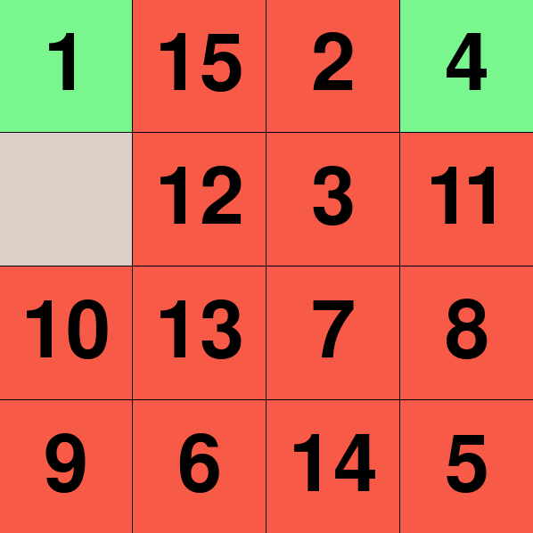

## n_puzzle

the École 42 project where it is necessary to create a program capable 
of solving n-puzzles of different sizes in order to achieve a state 
known as 'snail solution'.

the program works with 3 algorithms to choose from (a* search, greedy 
search, uniform cost search) and 3 heuristic functions to choose from 
(manhattan, euclidean, chebyshev).

the program can accept files or generate puzzles on its own.



### how to use

```
python3 n_puzzle.py -s <size> -algo <algorithm> -heur <heuristic function> -vis
```

optional arguments:

`-h` show help message and exit

`-f` puzzle file path

`-s` size of the puzzle's side

`-algo` used algorithm [a-star, greedy, uniform-cost]

`-heur` used heuristic function [manhattan, euclidean, chebyshev]

`-shuffle` number of puzzle shuffles

`-vis` solution visualization